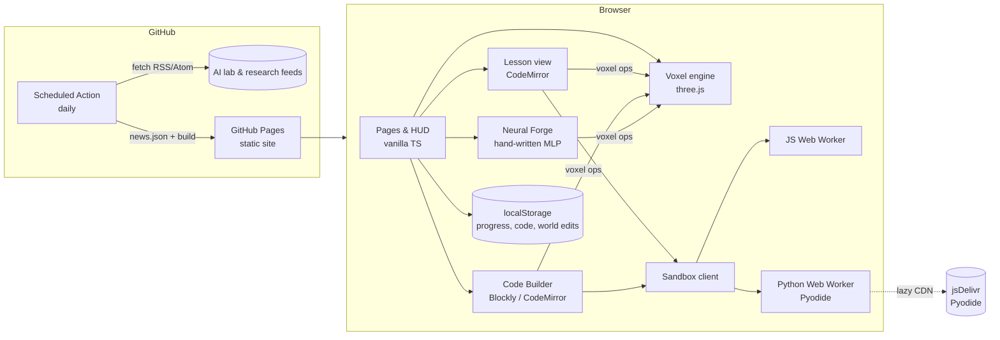

# NeuralCraft — Product & Technical Plan

**Author:** Aditya Rekhe · **Status:** v0.1 shipped (playable), roadmap below · **Last updated:** 25 September 2026

NeuralCraft is a free, no-sign-in, Minecraft-style 3D playground where developers learn AI, machine learning and data science from scratch to advanced. You walk a voxel world, write real **Python** or **JavaScript** (or snap **Blockly** blocks together), and your code's output is **built out of blocks** in front of you. A blog and a daily-refreshed AI news feed keep people up to date and give them a reason to come back.

---

## 1. Vision & goals

> *Make the first hour of learning ML feel like the first hour of Minecraft: curious, hands-on, and hard to put down.*

| Goal | How we measure it (privacy-preserving) |
|---|---|
| Zero-friction start | Time from landing page to first passed test < 2 minutes. No account, no install. |
| Real understanding, not trivia | Learners *implement* every concept (mean → attention → Q-learning) before using a library. |
| Keep people hooked | Visible progress (XP, levels, streaks, badges), instant 3D feedback, open-ended building. |
| Scratch → advanced | Six realms, 36 lessons from `square(x)` to self-attention and value iteration; more in the roadmap. |
| Free forever, cheap to run | Static hosting only. No servers, no databases, no GPU bills. |
| Stay current | Daily AI news feed + regular explainers on the blog. |

### Audience

1. **Curious developers** (web/mobile/backend) who want to understand ML without a 900-page textbook.
2. **Students** (high school → university) who respond to game-like learning.
3. **Self-taught career switchers** needing a structured, free path.
4. **Educators** who want a zero-setup classroom activity (works on Chromebooks; no accounts to manage).

---

## 2. Research

### 2.1 Learning science and engagement

- Research on gamification in education consistently finds that points, progress tracking, badges and rewards improve **motivation, engagement and knowledge retention** compared with traditional delivery, and that **browser-based** interactive material lowers the barrier to participation because it needs no preparation or install ([eLearning Industry, 2025](https://elearningindustry.com/gamification-in-learning-enhancing-engagement-and-retention-in-2025); [KICSS 2025 proceedings](https://arxiv.org/pdf/2512.20628); [Frontiers in Education meta-analysis, 2026](https://www.frontiersin.org/journals/education/articles/10.3389/feduc.2026.1754080/full)).
- A recurring caveat in the same literature: **extrinsic rewards alone fade**. What lasts is *intrinsic* motivation — curiosity, autonomy and visible mastery. Design implication: the reward is **the world changing because of your code**; XP and badges are seasoning, not the meal.
- **Worked examples → faded guidance → free practice** is an established progression. Each NeuralCraft lesson follows it: short theory → starter code with TODOs → hints on demand → solution as a last resort → open-ended Code Builder.
- **Immediate feedback** matters most for novices. Every run shows per-test results *and* a 3D rendering of the learner's actual output — even wrong answers produce a (wrong) shape, which is itself diagnostic.
- **Blocks → text transfer.** Block-based programming (Scratch/Blockly) removes syntax errors for beginners, but learners must be bridged to text. NeuralCraft's builder has a one-click "turn my blocks into JavaScript" and then offers Python.

### 2.2 Landscape: what already exists and the gap

| Platform | Strength | Gap NeuralCraft fills |
|---|---|---|
| Kaggle Learn | Fast micro-courses, free notebooks & GPUs | Requires sign-in; notebook UI isn't playful |
| fast.ai | Excellent practical deep learning | Assumes Python fluency and setup; video-first |
| Google ML Crash Course | Polished, free, interactive diagrams | Linear course; not a sandbox |
| TensorFlow Playground | Brilliant intuition for NNs | Single-purpose; no curriculum or code |
| Brilliant | Great interactive problem design | Paid; not code-first |
| Minecraft Education / Code.org | Engagement, blocks for kids | Not about ML/data science; accounts/licences |

Sources: [Class Central 2026](https://www.classcentral.com/report/best-machine-learning-courses/), [DataField.dev 2026](https://datafield.dev/blog/best-free-ai-learning-resources.html), [Kaggle](https://www.kaggle.com/).

**The gap:** nobody combines *(a)* a free, no-account, zero-install experience, *(b)* a scratch-to-advanced ML curriculum where you implement things yourself, *(c)* both blocks and real Python, and *(d)* a playful 3D sandbox where output becomes something you can walk around.

### 2.3 Technology research (September 2026)

| Need | Options considered | Decision & why |
|---|---|---|
| 3D rendering | three.js (WebGL / WebGPU renderer), Babylon.js, raw WebGPU | **three.js + WebGL** now for maximum device coverage (school Chromebooks). WebGPU is now in every major engine — Safari shipped it in Sept 2025 — with large draw-call and CPU-overhead wins, so a WebGPU path (and GPU meshing) is on the roadmap ([utsubo](https://www.utsubo.com/blog/threejs-2026-what-changed), [WebGPU voxel engine example](https://github.com/JamesKevinJones/webgpu-voxel-engine)). |
| Voxel meshing | InstancedMesh cubes, naive faces, greedy meshing | **Chunked face-culled meshing with per-vertex ambient occlusion** (16×64×16 columns, 3 render passes). Simple, fast enough for a 224×64×224 world, and looks great. Greedy meshing is a roadmap optimisation. |
| Python in the browser | Pyodide, PyScript, server-side kernels | **Pyodide 314.x** in a Web Worker, lazy-loaded from jsDelivr. Supports NumPy, pandas, SciPy, scikit-learn; `loadPackagesFromImports` fetches them on demand ([pyodide.org](https://pyodide.org/)). |
| JS sandbox | iframe, Web Worker, QuickJS | **Module Web Worker** with a hard timeout (terminate & respawn) so infinite loops can't freeze the tab. |
| Blocks | Blockly, Scratch-blocks | **Blockly 13** (Raspberry Pi Foundation), lazy-loaded; custom `place / fill / sphere / line` blocks generating JavaScript ([npm](https://www.npmjs.com/package/blockly)). |
| Code editor | Monaco, CodeMirror 6 | **CodeMirror 6** — a fraction of Monaco's size, good mobile support. |
| In-browser training | TensorFlow.js, ONNX Runtime Web, Transformers.js, hand-written | **Hand-written MLP** for the Forge (tiny, fully inspectable, verified against numerical gradients). TF.js is the choice for future custom-architecture training; ONNX Runtime Web / Transformers.js v4 for pretrained inference ([PkgPulse comparison](https://www.pkgpulse.com/guides/transformersjs-vs-onnx-runtime-web-2026), [Transformers.js](https://huggingface.co/docs/transformers.js/index)). |
| Hosting | Vercel, Netlify, GitHub Pages | **GitHub Pages** via Actions: free, static, and the same place as the code. Hash routing avoids SPA 404 issues. |
| "Up-to-date AI blogs" | Server-side CMS, client-side RSS fetch (CORS issues), build-time aggregation | **Build-time RSS/Atom aggregation** in a scheduled GitHub Action (daily) → static `news.json`. No CORS, no server, no API keys. Feeds: OpenAI, Google DeepMind, Google AI, Hugging Face, Microsoft Research, NVIDIA, AWS ML, BAIR, MIT News, MIT Tech Review, Ahead of AI, The Gradient ([feed list research](https://www.readless.app/blog/best-ai-news-rss-feeds-2026)). Original explainers live in `src/blog/posts/*.md`. |

---

## 3. Product design

### 3.1 The world

- **The Hub** (spawn): quartz plaza, crystal spire, six colour-coded **portals** — step on one to teleport to a realm.
- **Six realms** arranged in a ring 70 blocks from the hub, each with its own biome, a 25×25 **display pad** in the centre (where results are built), a ring of **lesson beacons**, and a return portal. Paths connect everything for players who prefer walking.
- **Stations** turn gold when completed, with floating labels showing status and XP.
- **Building**: break/place blocks Minecraft-style (hotbar 1–9, pick block), plus the **Code Builder** (B) that builds structures from code 3 blocks in front of the player, with undo.
- **Flying**, sprinting, auto step-up, mobile touch controls (virtual stick, look-drag, action buttons).
- World edits persist in `localStorage`.

### 3.2 The learning loop (per lesson)

```
Beacon ─► Theory (1 idea) ─► Mission ─► Code (Py/JS) ─► Run ─► Tests ✓/✗ + 3D build on pad
   ▲                                                     │
   └─────────── Next lesson ◄── XP / badges / level ◄────┘ (hints → solution if stuck)
```

### 3.3 The engagement loop (across sessions)

- **Short-term:** every run changes the world; every pass gives XP and turns a beacon gold.
- **Medium-term:** levels with titles (Novice → Legend), realm-clear badges, polyglot bonus (solve in the other language), Forge accuracy badges.
- **Long-term:** daily streaks, daily AI news, new blog posts, open-ended building.
- **No dark patterns:** no nagging notifications, no loss-aversion streak shaming, everything optional.

### 3.4 Curriculum (v0.1 — 36 lessons)

### Foundations Meadow

_Vectors, matrices and the maths every model is made of._

| # | Lesson | Level | You implement | 3D visualisation |
|---|---|---|---|---|
| 1 | Your first function | beginner | `square()` | Towers of 1², 2², … 6² — notice how fast squares grow. |
| 2 | Vectors | beginner | `vector_add()` | [3,1,4,1,5] + [2,7,1,8,2] as towers. |
| 3 | The dot product | beginner | `dot()` | — |
| 4 | Matrix × vector | intermediate | `mat_vec()` | Each tower is one row of the matrix dotted with [1,1,1] — the row sums. |
| 5 | Matrix multiplication | intermediate | `matmul()` | The 4×4 product as a heat-map: taller and warmer = bigger value. |
| 6 | Walking downhill | intermediate | `descend()` | w after 0…9 steps, climbing towards the minimum at w = 3. |

### Data Dunes

_Statistics and data wrangling: see a dataset before you model it._

| # | Lesson | Level | You implement | 3D visualisation |
|---|---|---|---|---|
| 1 | The mean | beginner | `mean()` | — |
| 2 | Spread: variance & std | beginner | `std()` | — |
| 3 | The median | beginner | `median()` | — |
| 4 | Min-max scaling | beginner | `normalize()` | Scaled values: the smallest becomes a 1-block stub, the largest reaches the top. |
| 5 | Histograms | intermediate | `histogram()` | Heights of 36 people in 9 bins — a rough bell curve rises from the pad. |
| 6 | Correlation | intermediate | `correlation()` | Study hours vs exam score. The gold pillar in the corner is /r/ × 10 blocks tall. |

### Model Woods

_Regression, classification and clustering — classical ML from first principles._

| # | Lesson | Level | You implement | 3D visualisation |
|---|---|---|---|---|
| 1 | Measuring error: MSE | beginner | `mse()` | — |
| 2 | Linear regression | intermediate | `fit_line()` | Blue: data points. Gold: your fitted line running through them. |
| 3 | Logistic regression | beginner | `predict_proba()` | — |
| 4 | k-Nearest Neighbours | intermediate | `knn_predict()` | The floor is coloured by your classifier's prediction; white-capped pillars are the training points. |
| 5 | k-Means clustering | advanced | `kmeans_step()` | Points coloured by cluster; gold-topped towers mark where your centroids moved. |
| 6 | Precision & recall | intermediate | `precision_recall()` | — |
| 7 | Decision trees: Gini impurity | advanced | `gini()` | — |

### Neural Peaks

_Neurons, layers, loss and backprop. Home of the Neural Forge._

| # | Lesson | Level | You implement | 3D visualisation |
|---|---|---|---|---|
| 1 | Activation: ReLU | beginner | `relu()` | relu(−6 … 6): a flat floor, then a straight ramp — the famous hinge shape. |
| 2 | A single neuron | beginner | `neuron()` | — |
| 3 | Softmax | intermediate | `softmax()` | The biggest logit grabs most of the probability mass. |
| 4 | Cross-entropy loss | intermediate | `cross_entropy()` | — |
| 5 | A dense layer | intermediate | `dense_forward()` | Eight neurons' activations for input [3, 2]. Stubs are neurons ReLU switched off. |
| 6 | Backpropagation | advanced | `gradients()` | — |
| ⚒ | Neural Forge | all | (no code) design & train an MLP | Live decision boundary painted on the pad |

### Token Tides

_Text, embeddings and attention — the ideas behind modern LLMs._

| # | Lesson | Level | You implement | 3D visualisation |
|---|---|---|---|---|
| 1 | Tokenisation | beginner | `tokenize()` | — |
| 2 | Bag of words | beginner | `bag_of_words()` | — |
| 3 | Embeddings & cosine similarity | intermediate | `cosine_similarity()` | Similarity grid for king, queen, apple, mango, prince. Royals cluster together; fruit clusters together. |
| 4 | Attention scores | advanced | `attention_weights()` | How much one query token attends to six key tokens. Taller = more attention. |
| 5 | Self-attention output | advanced | `attention()` | — |
| 6 | Sampling temperature | intermediate | `apply_temperature()` | Cyan row: T = 0.4 (sharp). Orange row: T = 2.5 (flat). Same logits! |

### Agent Arena

_Rewards, values and policies — reinforcement learning, hands-on._

| # | Lesson | Level | You implement | 3D visualisation |
|---|---|---|---|---|
| 1 | Discounted return | beginner | `discounted_return()` | — |
| 2 | Explore vs exploit (UCB) | intermediate | `ucb_pick()` | — |
| 3 | Q-learning | intermediate | `q_update()` | — |
| 4 | Value iteration | advanced | `value_iteration_step()` | Values of a 10-cell corridor after 12 sweeps. The goal (gold marker) is at the right end. |
| 5 | Greedy policy | intermediate | `greedy_policy()` | — |


**Design rules for lessons:** one idea per lesson; a function to implement with the same name in both languages; 2–4 tests written in the JS∩Python call syntax; hints ordered from nudge to near-answer; a visualisation whenever the output has a shape.

### 3.5 Pages

| Route | Purpose |
|---|---|
| `#/` | Landing page: pitch, how it works, realms, features, latest posts & news |
| `#/play[/<lesson|realm|forge|build>]` | Full-screen 3D world with HUD, panels, map & teleport |
| `#/learn` | Progress (level, streak, badges, export/import/reset) and the full lesson map |
| `#/learn/<lesson>` | Any lesson without 3D (with a small voxel preview) — for low-end devices & accessibility |
| `#/forge` | The Neural Forge standalone |
| `#/blog`, `#/blog/<slug>` | Articles by Aditya Rekhe |
| `#/news` | Daily AI headlines, filter & search |
| `#/about` | Principles, controls, privacy, author |

---

## 4. Architecture



### Source layout

```
src/
  curriculum/   realms, 36 lessons (theory, starters, solutions, tests, viz), viz helpers
  world/        blocks, procedural textures, biomes & layout, lighting (sky + RGB block light),
                mesher (AO, 4 render passes), chunk streaming, player physics, engine
  render/       voxel & water shaders, sky/sun/moon/stars, clouds, weather, particles,
                beams & portals, avatar, post-processing, quality presets
  audio/        procedural Web Audio: music, ambience, sound effects
  ai/           pure, tested algorithms: optimisers, A*, Q-learning, boids, Galton physics,
                3D k-means, word-embedding analogies, digit MLP inference
  sims/         the six labs, flock and Nova guide built on those algorithms; cinematic tour
  runtime/      harness (pure), JS worker, Python worker, sandbox client with timeouts
  ml/           seeded RNG, datasets, MLP with backprop
  progress/     XP, levels, badges, streaks, saved code — localStorage
  blog/         markdown posts + loader
  ui/           DOM helpers, router, pages, components (lesson, builder, forge, editor, preview)
scripts/        fetch-news.mjs (+ feeds.json), smoke.mjs (browser test), train-digits.ts (offline MNIST)
tests/          curriculum (both languages), MLP, world/mesher, lighting, AI algorithms, news parsing
```

### Key technical decisions

- **One test syntax for two languages.** Tests are calls like `softmax([1, 2, 3])` — valid in both JS and Python — evaluated in the learner's chosen language and compared with numeric tolerance. The test suite runs every lesson's reference solution in **both** languages (Pyodide in Node) and checks the starter code does *not* already pass.
- **Visualisation as data.** Lessons return values; `viz.render()` maps them to `VoxelOp[]` relative to the pad. The engine animates the build. The same ops drive a small `InstancedMesh` preview on the Learn page.
- **Deterministic world.** Terrain, textures and datasets are seeded, so every player sees the same world; only edits are saved.
- **Code-split heavy parts.** First load ≈ 52 KB gzipped; the engine, CodeMirror and Blockly load on demand; Python loads only when chosen.

### Performance budgets

| Metric | Budget | v0.1 |
|---|---|---|
| Initial JS (gzip) | < 80 KB | ~52 KB |
| World ready (mid laptop) | < 3 s | ~2 s in headless software-GL Chromium |
| Frame time | 60 fps on integrated GPUs | 196 chunks, 3 draw calls each, frustum-culled |
| Code run feedback | < 200 ms (JS), < 1 s (Python, after load) | JS ~50 ms |

### Security & privacy

- Learner code runs in Web Workers (no DOM access) with hard timeouts; build output is validated and capped at 60k blocks.
- No cookies, no analytics, no third-party trackers. Only external requests: Google Fonts, jsDelivr (Pyodide, on demand), and links the user clicks.
- News items are rendered as text (titles/summaries are HTML-stripped at build time) and open in a new tab with `rel="noopener noreferrer"`.

### Accessibility

- Every lesson is available without 3D (`#/learn/<id>`), keyboard-operable and screen-reader friendly.
- `prefers-reduced-motion` disables animations; focus rings on all controls; colour is never the only signal (✓/✗ marks, text labels).

---

## 5. Roadmap

### v0.1 — Playable foundation ✅ (this release)
- Voxel world: hub, 6 realms, portals, paths, stations, display pads, building, flying, touch controls, persistence.
- 36 lessons in Python & JavaScript with tests, hints, solutions and 3D visualisations.
- Neural Forge (5 datasets, 7 features, configurable depth/width/activation/LR/L2) with live 3D boundary.
- Code Builder: Blockly + Python + JavaScript, 8 examples, undo.
- XP, 11 levels, 16 badges, streaks, export/import.
- Blog (6 posts by Aditya Rekhe) + daily AI news pipeline.
- CI (typecheck, 108 unit tests, build) and GitHub Pages deploy; browser smoke test.

### v0.2 — A living, realistic world ✅ (this release)
- Rendering: smooth sky light and coloured block light (flood-fill, 16 levels per channel), real-time sun/moon shadow maps, physically based sky with a day/night cycle, stars, moon, voxel clouds, animated water with fresnel and specular, bloom, colour grade and FXAA/SMAA; Low → Ultra presets with automatic fallback.
- A 320 × 320 world with six biomes (meadow, dunes, forest, peaks, coast, volcanic), five tree species, flowers and grass, roads with street lamps.
- Weather (rain, thunderstorms with lightning, snow in the peaks), fireflies, falling leaves, birds, third-person avatar, swimming, head bob and fully procedural audio.
- Six walk-in simulation labs — gradient descent valley, Galton board, k-means nebula, neural cathedral (MNIST MLP), embedding galaxy, Q-learning maze — plus a boids flock and Nova, an A* guide; cinematic tour, photo mode and settings.

### v0.3 — Depth (next 4–6 weeks)
- **+20 lessons:** train/test split & overfitting, gradient-descent linear regression, decision-tree split search, naive Bayes, PCA, convolution on a pixel-art image, RNN step, embeddings arithmetic, BPE tokeniser, tiny bigram language model, policy gradient intuition.
- **NumPy track:** optional "now do it vectorised" follow-up for Python solutions.
- **Boss challenges** per realm: multi-function projects (e.g. build k-means end-to-end, then run it on 3D data you placed).
- Forge: regression mode, dropout, momentum/Adam, save/share network configs via URL.

### v0.4 — Community & creativity (6–10 weeks)
- **Shareable builds & worlds** via URL-encoded or gist-backed JSON (still no accounts).
- **Community realms:** lesson packs as JSON/Markdown submitted by PR, reviewed and loaded as new islands.
- **Daily challenge** seeded by date (same puzzle for everyone; local streak).
- Blog: tag pages, RSS feed of our own posts, OG images generated at build.

### v0.5 — Scale & polish
- WebGPU renderer path + greedy meshing + larger worlds; LOD for far chunks.
- Offline PWA (service worker caching engine + Pyodide).
- i18n (Hindi, Spanish, Portuguese first), full accessibility audit.
- Optional **multiplayer study rooms** via WebRTC (peer-to-peer; no server state).

### v1.0 — Advanced track
- In-browser **mini-GPT**: train a character-level transformer with TF.js/WebGPU and generate text into signs in the world.
- Pretrained models via Transformers.js/ONNX: embeddings search realm, image classifier realm.
- Capstone projects with downloadable notebooks for continuing in Colab/Kaggle.

---

## 6. Risks & mitigations

| Risk | Mitigation |
|---|---|
| Low-end devices can't run 3D smoothly | Every lesson works on `#/learn`; pixel ratio capped at 2; fog-limited view distance; cheap unlit materials with baked lighting. |
| Pyodide download (~10 MB) on slow networks | Lazy-loaded only when Python is chosen, cached by the browser; JS always available instantly. |
| RSS feeds change or break | Per-feed timeouts and error isolation; if all fail, the previous `news.json` is kept; feed list is a JSON file. |
| Learners copy solutions | Solutions require a confirmation before any attempt; the value is in the build, not the badge. |
| Streak mechanics feel manipulative | No notifications, no penalties, best streak remembered. |
| Scope creep | Roadmap is versioned; lessons follow a strict template; tests guard every lesson in both languages. |

---

## 7. Operations

- **Local dev:** `npm install && npm run dev`.
- **Quality gates:** `npm run typecheck`, `npm test` (unit), `npm run build`, `npm run smoke` (browser, against `vite preview`).
- **Deploy:** push to `main` → GitHub Actions builds (fetching fresh news) → GitHub Pages. A daily cron rebuild keeps news current. One-time setup: *Settings → Pages → Source: GitHub Actions*.
- **Adding a lesson:** add an object to `src/curriculum/lessons/<realm>.ts`; the test suite automatically verifies both solutions and adds a station to the world.
- **Adding a blog post:** drop `YYYY-MM-DD-slug.md` with frontmatter into `src/blog/posts/`.
- **Adding a news source:** append to `scripts/feeds.json`.
